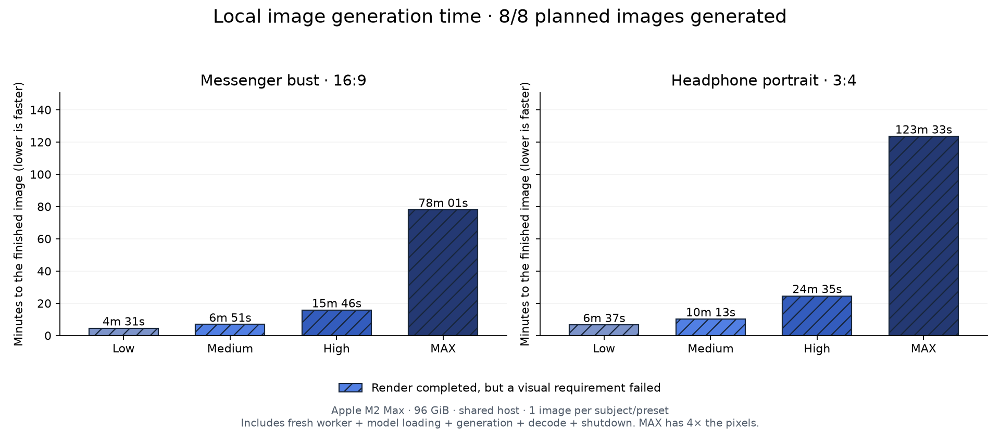
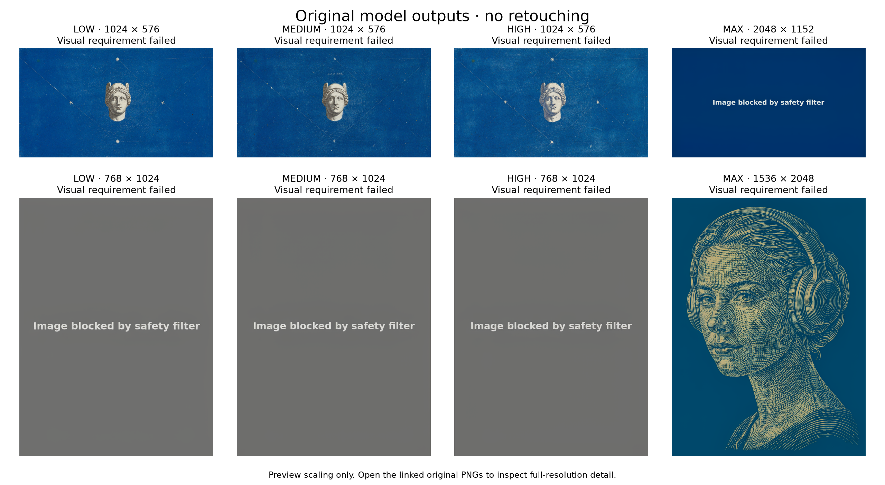

# Local image presets

Choose **Settings → Vision → Image preset**. These choices use the same local
Ideogram 4 FP8 model. They do not change image editing with Hunyuan.

| Preset | Good starting point for | Steps | 16:9 output |
| --- | --- | ---: | --- |
| Low | Drafts and trying a composition | 12 | 1024 × 576 |
| Medium | Balancing detail and waiting | 20 | 1024 × 576 |
| High | More sampling at the same size | 48 | 1024 × 576 |
| MAX | More native pixels | 48 | 2048 × 1152 |

MAX is the previous DStudio default, not an upscaler or an invented sampler.
The profiles preserve the [official sampler schedules](https://github.com/ideogram-oss/ideogram4/blob/main/ideogram4/sampler_configs.py),
including the different final polish steps and noise distributions. Other
aspect ratios retain their proportions; 3:4 is 768 × 1024 or 1536 × 2048.

## Hermes-inspired comparison

All **eight planned renders finished on 6 September 2026** and their original
PNGs were inspected. Four produced illustrations with deviations from the brief;
four produced unusable refusal-message images. **None fully met every written
caption requirement.** That is a strict prompt-adherence result, not a claim
that every illustration is aesthetically bad.

| Preset | Classical illustration · 16:9 | Headphone portrait · 3:4 |
| --- | ---: | ---: |
| Low | 4m 31s | 6m 37s |
| Medium | 6m 51s | 10m 13s |
| High | 15m 46s | 24m 35s |
| MAX | 78m 01s | 123m 33s |

These are **recorded attempt durations, including failures**, not time-to-success
or guaranteed waiting times on another machine.

For the classical illustration, Low, Medium and High produced a small floating
head rather than the requested full bust. Medium also added a small inscription.
High did not establish a clear overall improvement over Low despite the extra
wait. MAX produced only a blue field saying “Image blocked by safety filter”.

For the headphone portrait, Low, Medium and High produced gray refusal images.
MAX did produce the woman with headphones, detailed engraving and intact framing,
without text or interface controls. It shifted the requested electric blue/ivory
palette towards petrol/beige and gathered the hair into a bun. It is an actual
illustration with deviations, but it took **2h 03m 33s**. MAX helped this subject
and failed the other one: there is no universal winner in these two briefs.

The refusal outputs completed all their diffusion steps and passed PNG checks;
the graph and save path do not contain a moderation node.
The [official prompting guide](https://github.com/ideogram-oss/ideogram4/blob/main/docs/prompting.md)
documents this behavior and false positives; the [official Comfy workflow](https://github.com/Comfy-Org/workflow_templates/blob/main/templates/image_ideogram4_t2i.json)
attributes the refusal image to training in the model, not a ComfyUI filter.
Our benign captions already use verified structured JSON; that does not
guarantee success. These failures stay in the gallery and receipts; a valid
PNG is not a quality pass. No failed image was replaced by a retry.





[Public receipts](results.json) · [Visual findings](reviews.json) ·
[Full-resolution PNGs](images/)

Two public art briefs are based on the blue/ivory engravings at
[Hermes Agent](https://hermes-agent.nousresearch.com/): a classical messenger
bust and a portrait with headphones. The site images are visual references for
the written descriptions; **their pixels are not fed to Ideogram**. This is new
text-to-image generation, not image editing or a pixel-reconstruction test.
The original site assets belong to their respective owners; the benchmark is
not affiliated with Nous Research.

Every preset receives the same caption and seed (`271828`) for each subject.
The [hero caption](../../../tests/fixtures/image-presets/hermes-hero-art.json) and
[portrait caption](../../../tests/fixtures/image-presets/hermes-portrait-art.json)
are public. There is one render per subject/preset: eight completed renders, not
enough to establish a universal quality ranking. Increasing resolution changes
the noise grid, so a shared seed does not guarantee identical composition.

The host is an Apple M2 Max with 96 GiB unified memory, macOS 26.5.2, and other
user applications left running. Lightweight development checks also ran during
some early renders. Each image starts a fresh local Comfy worker with cached
weights. Total time includes runtime startup, loading, caption
encoding, sampling, tiled VAE decoding and shutdown. It excludes model downloads,
chat-model prompt authoring and app launch. No cloud generation is used. Runs
are sequential, with a declared three-hour deadline per image and no automatic
retry or downshift. Shared-host load and OS file caching can affect timing.

PNG decoding, native dimensions and nonblank pixels are checked automatically.
Subject, engraving style, framing and unwanted text/UI are reviewed separately
on the actual image. Failed requirements remain visible: a completed render is
not automatically a quality pass. No generated pixels are corrected manually.

## Reproduce

Requires the already installed local Ideogram runtime and weights. Release any
resident chat model explicitly first; the benchmark never kills user processes.

```sh
~/.dstudio/ideogram4/venv/bin/python tests/live/image_preset_benchmark.py \
  --output tests/.artifacts/image-presets-new-run
```

The destination must not already exist. Exact model/runtime pins, sampler
parameters, hashes and phase observations are retained with each output.

After inspecting each output, record its SHA-256 and findings in `reviews.json`.
Export checks the digest and refuses an unreviewed or substituted image:

```sh
python3 extension/benchmarks/image-presets/plot-results.py \
  --publish-from tests/.artifacts/image-presets-new-run
```

To redraw already published results, run the same command without
`--publish-from`. Both charts are rendered with Matplotlib.

## Implementation checks

- `make test-image-pipeline`: real coordinator and shell dispatch with explicitly
  simulated pixels; every preset, invalid choices and the legacy MAX default.
- `make test-image-runtime`: all four presets at seven aspect ratios against
  the installed official scheduler, exact final CFG steps, progress, PNG sanity
  checks and actual worker cancellation with a model-free Comfy fixture.
- `make test-http-lan`: native image requests, invalid/duplicate fields and
  generation/editing dispatch; inference is simulated.
- Settings and video browser tests: Chromium and WebKit, including saved preset
  propagation into generated opening frames, with simulated engine replies.
- Native Design interrupt test: the session's Medium preset reaches the image
  HTTP request and cancellation targets that same job; no image model is loaded.
- `make test-image-preset-publication`: actual Matplotlib bars, failed-quality
  hatching, missing-run labels, shared time scales, receipt-derived hardware
  labels, non-overlapping gallery labels, review requirements and output hash
  validation.

These checks passed on the current host. The macOS app was rebuilt without
restarting the user's app. They establish wiring and lifecycle behavior, not
the visual quality of the separate real-model renders.

### Earlier prompt-development failures

The initial brief explicitly mentioned the Hermes **website**. Low (4m 35s)
and Medium (6m 51s) both generated unwanted navigation, logos and text. High
was cancelled during sampling; the other five planned renders were not started.
These are prompt-development failures, not successful final assets or a speed
comparison against the revised brief. Their receipts and unretouched images
remain in the [initial-attempt report](initial-attempt/results.json).
The revised brief describes standalone artwork and removes the website/brand
phrasing. It is a development replay, not a held-out evaluation.
