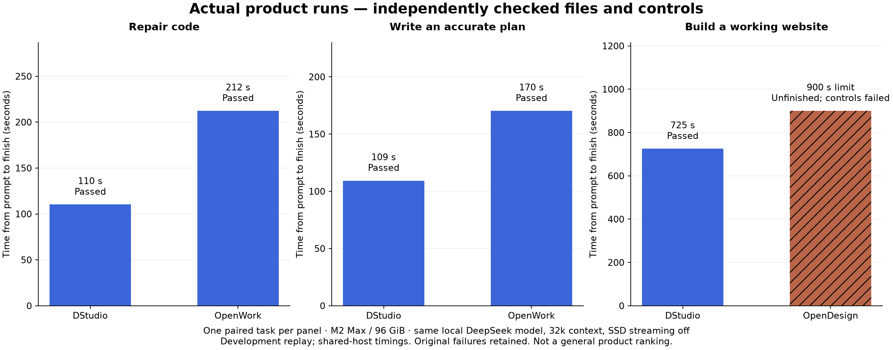
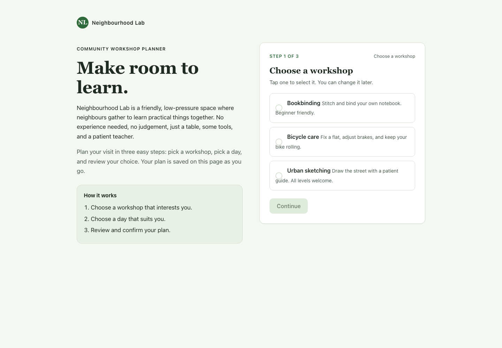
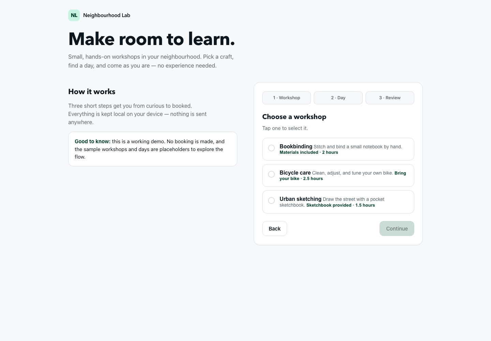
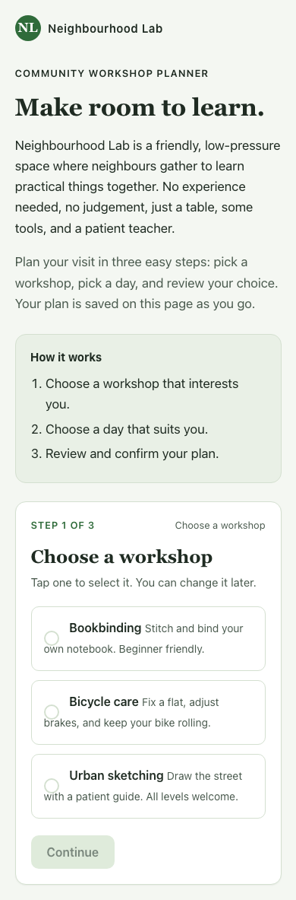
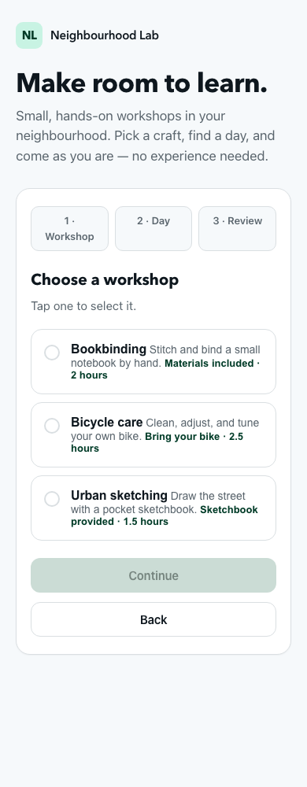

# Real tasks: DStudio, OpenWork and OpenDesign

Both DStudio and OpenWork correctly repaired the code and wrote the community
plan. DStudio finished sooner in these two runs. For the website brief, DStudio
produced a working three-step flow; OpenDesign reached the 15-minute deadline,
and its partial page had JavaScript errors that prevented Continue from working.

**One paired task per category is not a general product ranking.** These are
development checks with a shared local model, not a claim that DStudio always
wins or that the underlying model became more intelligent.

| Actual task | DStudio | Comparison product |
| --- | --- | --- |
| Fix UTC grouping and save regression tests | Passed, 110 s | OpenWork: passed, 212 s |
| Merge updated documents into an accurate plan | Passed, 109 s | OpenWork: passed, 170 s |
| Build and operate a three-step workshop page | Passed, 725 s | OpenDesign: unfinished at 900 s; partial controls failed |



## What changed, and what the tests actually prove

The original Agent/Cowork attempt found a real DStudio regression: remote-mode
tools were acting in the engine checkout instead of the selected workspace.
The fix changes directory exactly once before the remote runtime starts.
The original failed attempts remain in the public data; the corrected replay
is a separate measurement. Both products now pass the same independent code
and document checks, including unchanged source files.

The coding oracle executes the saved function on empty input, UTC offsets
crossing midnight, repeated dates, out-of-order dates and invalid records.
It also executes the permanent tests the product saved. The document oracle
reopens the Markdown and checks the approved owner/date, unchanged activity,
24 confirmed participants, excluded cancellations and unresolved room.

The website audit operates the unchanged HTML in actual Chromium at desktop,
tablet and phone widths. It checks fitted content, required choices, disabled
Continue, Back preserving choices, a correct review, honest final demo feedback,
and offline loading without script errors. It is **not an aesthetic score** or
a complete accessibility/WebKit qualification. The partial OpenDesign file fits
the viewports but throws errors when binding/using missing DOM elements.

## Exact website prompt

```text
Build directly, without discovery questions. Create workshop.html for NEIGHBOURHOOD LAB, a welcoming general-purpose community workshop planner for first-time participants, primarily on a phone. Exact heading: Make room to learn. Implement a three-step journey: Choose a workshop, Choose a day, Review. Workshops: Bookbinding, Bicycle care, Urban sketching. Days: Tuesday, Thursday. Continue must be unavailable until the current step has a selection. Back preserves the choice. Review displays both choices. Final confirmation explicitly says No booking was made: this is a local demo, with clearly labelled sample data. Use readable typography, calm green, strong keyboard focus and clear field labels. On desktop place a human introduction beside one focused step panel; on mobile put the current action below the heading. No horizontal page scrolling, gradients, network dependencies or external assets. Use your available local design resources where appropriate. Save a finished offline HTML prototype with real controls, inspect its rendering and exercise the controls before claiming completion.
```

Actual outputs, not redesigned benchmark illustrations:

| DStudio | OpenDesign — partial output at deadline |
| --- | --- |
|  |  |
|  |  |

The visual tradeoff is visible: OpenDesign puts the phone's action closer to the
heading; DStudio places more explanatory text before the controls. A functional
pass does not erase that usability opportunity. No generated HTML was repaired
for these screenshots: [DStudio HTML](examples/dstudio-workshop.html),
[OpenDesign partial HTML](examples/opendesign-workshop.html).

## Exact Agent and Cowork prompts

Agent:

```text
Fix summary.mjs so summarize(rows) groups event amounts by UTC calendar date, sums numeric amounts, ignores rows with invalid dates or non-finite amounts, and returns ascending dates as objects with date and total. Keep the exported API. Add and run a permanent Node regression test covering offsets that cross midnight, repeated dates, invalid records and empty input. Do not modify input.json. Use only local files, no network. Finish the actual file edit and tests, not just an explanation.
```

Cowork:

```text
Read all three local source files. Write plan.md as a concise, usable plan for the community workshop, not a finance report. Include a Markdown table with activity, current owner, current date and source filename; use the update over the older brief and retain unchanged activities. Compute the total registered participants from attendance.csv excluding canceled rows and explain the rule. Mark the room assignment as unresolved if it is not in the sources. Do not invent confirmations. Preserve all source files. Use only local tools; no network.
```

[Exact starting files](../../../tests/fixtures/product_quality_cases.mjs),
[DStudio code](examples/dstudio-summary.mjs), [OpenWork code](examples/openwork-summary.mjs),
[DStudio plan](examples/dstudio-plan.md), [OpenWork plan](examples/openwork-plan.md).

## Method and limitations

- Apple M2 Max, 96 GiB, actual DeepSeek V4 Flash Chat IQ2XXS weights, resident
  with SSD streaming off, 32k context, thinking off, temperature 0.2, seed
  20260906 and an 8192-token ceiling. Tools and product prompts remain native.
- Actual [OpenWork `6c5dfca`](https://github.com/different-ai/openwork/commit/6c5dfca66a239b65a113fc7c787e5e17de43d59b)
  server with its managed runtime/plugins, and actual
  [OpenDesign `3d0d15f`](https://github.com/nexu-io/open-design/commit/3d0d15fc55031e8e6cead709491e7b82565c4dee)
  daemon with its BYOK adapter. Both use OpenCode 1.18.18 internally; neither
  result is substituted with a standalone generic OpenCode command.
- OpenDesign advertises 128k/16k to its adapter while the shared engine actually
  has 32k/8192. This mismatch is disclosed, not presented as identical product
  defaults. Smaller auxiliary request caps are preserved in the corrected replay.
- Timings run from task submission to runtime completion; model loading and
  product setup are outside them. OpenDesign's 900 s is the deadline, **not a
  successful completion time**. Shared-host development/setup activity overlaps
  collection; this is not an isolated causal speedup or a native tokens/s test.
- Initial OpenWork attempts had zero inference requests: the harness queried it
  before its managed proxy was ready. They are setup failures, not product
  quality failures. Corrected paired Agent/Cowork runs replace neither the
  original receipts nor their documented explanation.
- Browser grader defects were corrected with regressions: brand capitalization
  was not required, demo disclosure belongs at the requested final confirmation,
  and both product routes must serve their actual files. Corrected checks were
  applied to both unchanged artifacts. All original private receipts remain.
- Public fictional inputs, final artifacts, counts, provenance hashes and plot
  data are provided. Private full model/config transcripts and personal paths
  are excluded. The original pilot did not record every binary digest; this is
  development evidence, not a fully hermetic reproduction or held-out evaluation.

[Reviewed measurements and original-attempt outcomes](results/2026-09-06-m2-max.json).
Regenerate the Matplotlib chart without loading a model:

```sh
python3 extension/benchmarks/product-comparison/plot-results.py
```

The [live runner](../../../tests/live/product_quality_pilot.mjs) requires built
pinned competitor checkouts and isolated tools; the
[setup check](../../../tests/integration/product_comparison_setup.mjs) exercises
their real APIs without inference. Heavy runs are opt-in and sequential.

The recorded setup used Node 24.20.0, Bun 1.3.14, pnpm 11.4.0 for OpenWork;
OpenDesign's install used pnpm 10.33.2 with Node 24. Its pinned source was not
modified. After installing/building the pinned products and the local weights:

```sh
node tests/live/product_quality_pilot.mjs --run \
  --openwork /path/to/openwork --opendesign /path/to/open-design \
  --tools /path/to/isolated-tools/bin
```
