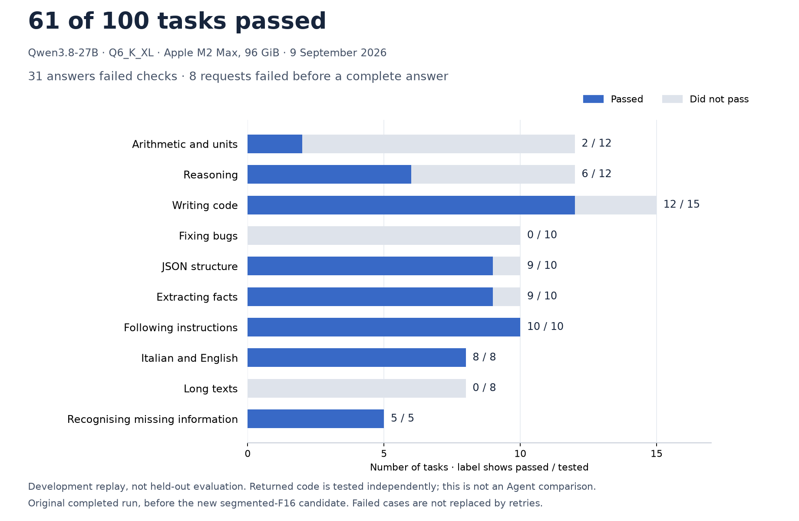

# Qwen27B: what passed, and what still needs work

**61 of 100 tasks passed in this completed local run.** The other 39 remain
failures: 31 answers did not meet their checks, and eight long requests did
not produce a complete answer. This does not qualify the entire Qwen family.



The strongest results in this small corpus were instruction following,
Italian/English and recognising missing information. Arithmetic, debugging
patches and long contexts need improvement. Nine answers contained the right
value inside an explicitly forbidden wrapper; they still failed the requested
format. None receives partial credit in the chart.

The eight long-context failures comprise three native Metal HTTP 500 errors
and five original 900-second deadlines. Supervised restarts only continued
with the next case; failed cases were never retried or removed. The new
[segmented-F16 candidate](../../../patch/q36-f16-attention/README.md) is being
verified separately and **is not the engine measured in this chart**.

## What this run measures

This is a **development replay**, not a fresh held-out evaluation. The frozen
corpus checks returned answers, programs and patches with independent expected
results. It does not run an Agent tool loop, compare agents, establish general
intelligence or prove numerical equivalence to another inference engine.
There are 100 tasks across ten categories and one execution of each task in
this run. Unequal category sizes remain visible; no confidence interval or
speedup is claimed.

Recorded configuration: Apple M2 Max, 96 GiB unified memory; Qwen3.8-27B
Q6_K_XL, resident Metal with quality kernels and F16 KV, no expert streaming;
context capacity 65,536 tokens, prefill chunks of 128, thinking off,
temperature 0, seed 20260909, maximum 2,048 output tokens. Deadlines were
180 seconds for ordinary cases, 240 for code and 900 for long contexts.
The host was shared with other applications, and model-free tests also ran
during the original run. These results must not be used for a causal speed
comparison. Capacity is not a claim that every question used 65,536 tokens.

The source was `Ninnix/q36` revision `d67687ed15ad9f52b755a9b5fdfc0214ea937555`
with DStudio Metal patch `75764a9f…`; binary, weights, corpus and source-receipt
hashes are in the [public aggregate](results/2026-09-09-qwen27-common100.json).
Original requests, responses, source snapshots and local paths remain in
ignored evidence. The aggregate is sufficient to reproduce the chart, not
independently reproduce all raw-answer grading. The
[corpus](../../../tests/fixtures/common_model_quality_cases.py) and
[grader](../../../tests/support/common_model_quality.py) are available.

## Recreate the chart

Requires Python 3 and Matplotlib. No model, network or user documents are used:

```sh
python3 extension/benchmarks/qwen-quality/plot-results.py
python3 tests/unit/qwen_quality_chart_test.py
```

The plotting test checks actual bar lengths and the failure denominator,
rejects inconsistent/partial receipts and keeps the original results unchanged.
See the [Qwen checkpoint](../../../docs/QWEN_CHECKPOINT.md) for later work.
